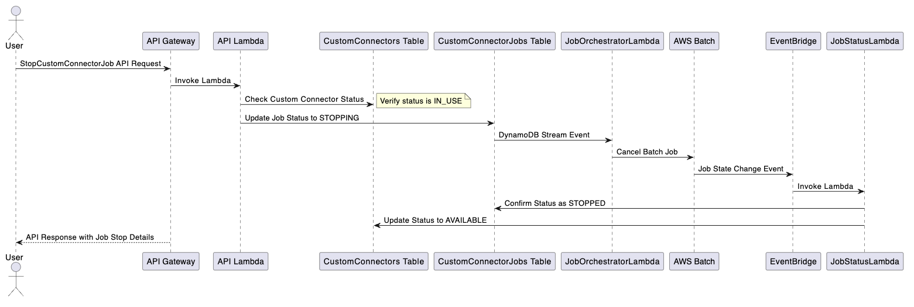

# Amazon Q Business Custom Connector Framework Developer Guide

The `Amazon Q Business Custom Connector Framework` (CCF) is designed to simplify the process of building and managing data ingestion connectors for Amazon Q Business. While Amazon Q Business provides many pre-built connectors out-of-the-box, organizations often need to integrate with unsupported systems, which is where custom connectors come in.

The `CCF` provides a simplified way to index external data in Amazon Q Business, enabling organizations to make their proprietary data searchable and accessible through the Amazon Q Business interface.

## Purpose
There are many challenges when building custom connectors. First, you need to understand the third party API in order to fetch the data. This entails understanding the available resources you want to index, rate limits, change detection, and authentication. Second, you need to understand Amazon Q Business APIs in order to index the data in the Amazon Q Business. Part of using the Q Business APIs entails modeling your data, adding the appropriate access controls, and understanding supported document types/size. Lastly, you need infrastructure to run your custom connector.

The `CCF` is intended to help with the aformentioned challenges allowing you to focus on writing the code for your custom connector and not worry about the nuances, such as, provisioning infrastructure, job orchestration, managing document checksums, or even understanding the Amazon Q Business APIs to index or delete documents.

## Key Features:
The `CCF` provides several key features. The framework provides: 
1. A set of APIs backed by a serverless architecture that will help assist with running your custom connector code using foundational AWS services. Additionally, to simplify the API architecture, a boto3 client is available.
2. A builder kit (python package) that simplifies the complexities with interacting with the Amazon Q Business APIs. Additionally, a thick client that wraps the CCF boto3 client, assisting with interactions with the CCF APIs (more details on the APIs will follow). 
3. A set of example custom connectors to help you get started. Such as, a web crawler and GitLab connector.

The `CCF` APIs and examples are deployable using the AWS Cloud Development Kit (CDK) and AWS CloudFormation to help expidite the development process.

## Role of the builder (or agent)
When adopting a new framework, it is often difficult to grasp the foundational concepts and how to get started. This section will show you a simplified preview on how to build a custom connector using the builder kit.

Assumptions:
1. You have a Q Business application
2. You have created an [index](https://docs.aws.amazon.com/amazonq/latest/qbusiness-ug/select-retriever.html).
3. You have created a [custom data connector](https://docs.aws.amazon.com/amazonq/latest/qbusiness-ug/custom-connector.html).

To create a custom connector, you need to implement the [`QBusinessCustomConnectorInterface`](./custom-connector-framework-builder-kit/src/custom_connector_framework/custom_connector_interface.py). The `QBusinessCustomConnectorInterface` will upload documents to Amazon Q Business. You will need to implement two methods:
1. `get_documents_to_add(self) -> Iterator[Document]`:  A `Document` is a [pydantic](https://docs.pydantic.dev/latest/) model that contains the necessary information to index your document.
2. (Optional) `get_documents_to_delete(self) -> Iterator[str]`: A list of document IDs that should be deleted. This is optional if deletions aren't tracked.

Here is a simple example of building a custom connector:
```python
import boto3
import os
from custom_connector_framework.custom_connector_interface import QBusinessCustomConnectorInterface
from custom_connector_framework.models.document import Document, DocumentFile, DocumentMetadata
from custom_connector_framework.models.qbusiness import (AccessControl, AccessType, 
                                                         MemberRelation, MembershipType, 
                                                         Principal, PrincipalUser)
from typing import Iterator

class MyCustomConnector(QBusinessCustomConnectorInterface):
    def __init__(self, *args, **kwargs):
        super().__init__(*args, **kwargs)

    def get_documents_to_add(self) -> Iterator[Document]:
        # (Optional) Access controls are optional to implement. 
        access_control = AccessControl(
            memberRelation=MemberRelation.OR,
            principals=[
                Principal(
                    user=PrincipalUser(
                        id="jon.doe@example.com",
                        access=AccessType.ALLOW,
                        membershipType=MembershipType.USER
                    )
                ),
                Principal(
                    user=PrincipalUser(
                        id="example-group",
                        access=AccessType.ALLOW,
                        membershipType=MembershipType.GROUP
                    )
                )
            ]
        )

        

        fake_doc = Document(
            id="fake-document-id-1",
            file=DocumentFile("/path/to/fake/file.txt"), # Assume the file was already written to the file system
            metadata=DocumentMetadata(
                title="Fake Document Title",
                source_uri="https://example.com/fake-document",
                attributes={
                    "author": "Custom Connector Framework",
                },
                access_control_list=[access_control]
            )
        )
        yield fake_doc

    def get_documents_to_delete(self) -> Iterator[str]:
        return iter(["fake-document-id-2"])

def main():
    qbusiness_app_id = os.environ['Q_BUSINESS_APP_ID']
    qbusiness_index_id = os.environ['Q_BUSINESS_INDEX_ID']
    qbusiness_data_source_id = os.environ['Q_BUSINESS_DATA_SOURCE_ID']

    qbusiness_client = boto3.client('qbusiness')

    connector = MyCustomConnector(
        qbusiness_client=qbusiness_client,
        qbusiness_app_id=qbusiness_app_id,
        qbusiness_index_id=qbusiness_index_id,
        qbusiness_data_source_id=qbusiness_data_source_id
    )

    connector.sync()

if __name__ == "__main__":
    main()
```

From this example you can see how simple it is to get started building a custom connector. When the `sync` function is called, the builder kit will handle transforming your data into a format that Q Business APIs accepts. We will dive into the builder kit and examples in a later section. 

## Core Concepts
Before you get started building custom connectors, it helps to understand the fundamental concepts of the `CCF`. 
1. `Custom Connector`: A custom connector is an abstraction that maintains information necessary to run a custom connector job. This is not to be mistaken with a Q Business custom connector. 
2. `Custom Connector Job` A custom connector job is a unit of work that executes your custom connector code. Only one custom connector job can execute at a time per custom connector. This restriction is due to the Q Business APIs. You can create multiple custom connectors in both the `CCF` and Q Business for this limitation. 
3. `Document`: A document maintains state of documents you have indexed, such as document IDs, checksums, created date, and last updated date. This is an optional functionality, but it can assist in change detection, deletion, and other requirements.
4. `CheckPoint`: A checkpoint is an arbitray map of data associated with a custom connector that maintains state about the last custom connector job execution. This is optional functionality, but it can assist with incremental syncs.

## Architecture
The CCF consists of several components that help run your custom connector code. 

1. **API**: We use AWS API Gateway as the primary entry point. The API uses AWS_IAM authorization requiring clients to authenticate using AWS credentials. When using AWS_IAM authorization, clients need to sign their requests using AWS credentials (access key ID and secret access key). API Gateway then verifies this signature using Signature Version 4 (SIGv4), ensuring the requests originates from a trusted source. By default the only account authorized to make requests to the API are the account in which the CCF is deployed. 
2. **Lambda Compute**: Used to handle API requests, job orchestrations, and status udpates. 
3. **Storage**: We use DynamoDB tables to store metadata for the custom connectors (), jobs, and documents as outlined in the [Core Concepts](#core-concepts) section. The tables can be found within the architecture diagram outlined below.
4. **Compute**: Custom connector jobs are run as containers on AWS Fargate, orchestrated by AWS Batch. 
5. **Events**: Events are used to orchestrate the lifecycle of jobs. When a job is started or stopped events from the jobs table are streamed, using DynamoDb Streams, to a lambda to either start or stop a job. When the Batch job running the custom connector completes and event is emitted to mark the job as in a terminal state depending on the outcome of the job. 


## API Reference
The CCF provides a set of easy to use RESTful APIs backed by a boto3 client to help manage the lifecycle of your custom connector jobs. These APIs follow AWS standards for authentication, request/response formats, and error handling, making them consistent with other AWS services.

Please see the [OpenAPI schema](./docs/CustomConnectorFrameworkOpenApiSpec.json) for the most up to date API documentation.

The APIs operations are related to the [Core Concepts](#core-concepts) outlined above. We have the following API operations:

### Custom Connector Operations
A custom connector is an abstraction that maintains information necessary to run a custom connector job. This is not to be mistaken with a Q Business custom connector. A custom connector can be in one of two states `AVAILABLE` or `IN_USE`. When a custom connector is `AVAILABLE` you are able to start custom connector jobs. This is to prevent multiple concurrent jobs for the same custom connector. API operations for jobs, checkpoints, and documents are all contained within a "custom connector", effectively isolating the resources from other custom connectors. 

#### Operations:
1. **CreateCustomConnector**: Creates a new custom connector.
1. **GetCustomConnector**: Retrieves details of a specific custom connector.
1. **UpdateCustomConnector**: Updates details of a specific custom connector.
1. **ListCustomConnectors**: Returns a list of custom connectors
1. **DeleteCustomConnector**: Retrieves details of a specific custom connector.

#### Workflow(s):
When the above operations are called the API Lambda will either create, update, or delete the custom connector object within the `CustomConnectors` table.

### Custom Connector Jobs
A custom connector job is a unit of work that executes your custom connector code. Only one custom connector job can execute at a time per custom connector. This restriction is due to the Q Business APIs. You can create multiple custom connectors in both the `CCF` and Q Business for this limitation. 

#### Operations:
1. **StartCustomConnectorJob**: Starts a custom connector job for a specific custom connector.
2. **StopCustomConnectorJob**: Stops a custom connector job for a specific custom connector.
3. **ListCustomConnectorJobs**: Lists custom connector jobs for a specific custom connector.

#### Workflow(s):
1. **Start Custom Connector Job Workflow**: The Start Custom Connector Job workflow begins when a user makes an API request, which is handled by the API Lambda that first verifies the Custom Connector is `AVAILABLE` and then updates its status to `IN_USE` while creating a new job entry with `STARTED` status in DynamoDB. The creation of this job entry triggers a DynamoDB Stream that invokes the JobOrchestratorLambda to submit the job to AWS Batch and update the job status to `RUNNING`. Upon AWS Batch job completion, an EventBridge rule captures the state change event and invokes the JobStatusLambda, which updates the job status to either `SUCCEEDED` or `FAILED` and sets the Custom Connector status back to AVAILABLE, allowing new jobs to be started. The previous text is outlined in the :

1. **Stop Custom Connector Job Workflow**: The Stop Custom Connector Job workflow is initiated when a user makes a StopCustomConnectorJob API request, which is handled by the API Lambda. The Lambda first verifies that the Custom Connector status is `IN_USE`, the job is not in a terminal status (`STOPPED`, `FAILED`, or `COMPLETED`), then updates the job status to `STOPPING` in the CustomConnectorJobs table. This update triggers a DynamoDB Stream event, invoking the JobOrchestratorLambda to cancel the corresponding AWS Batch job. When the job cancellation is complete, an EventBridge rule captures the state change event and invokes the JobStatusLambda, which confirms the job status as `STOPPED` in the CustomConnectorJobs table and updates the Custom Connector status to AVAILABLE in the CustomConnectors table, allowing new jobs to be started.


### Documents
A document maintains state of documents you have indexed, such as document IDs, checksums, created date, and last updated date. This is an optional functionality, but it can assist in change detection, deletion, and other requirements. When using the framework builder kit you can optionally supply the `CCFClient`. This will then handle updating and deleting documents on your behalf. For example, during each job run you fetch documents from your source system and provide that Document to the builder kit interface. The framework will detect if there have been updates to the document, document metadata, or access controls. If there have been any changes, we will update the Amazon Q Business index and the documents within the CCF. More details can be found in the [custom connector framework builder kit](./custom-connector-framework-builder-kit/README.md). Conversely, if you want to delete documents from the Q Business index during your custom connector job, you can use the documents within the CCF as a reference to what is currently indexed. 

#### Operations:
1. **BatchPutCustomConnectorDocuments**: Adds or updates multiple documents for a specific custom connector. 
1. **BatchDeleteCustomConnectorDocuments**: Deletes multiple documents for a specific custom connector. 
1. **ListCustomConnectorDocuments**: Lists documents for a specific custom connector. 

#### Workflow(s):
When the above operations are called the API Lambda will either create, update, or delete the custom connector document objects within the `CustomConnectorDocuments` table.

### CheckSums
A checkpoint is an arbitray map of data associated with a custom connector that maintains state about the last custom connector job execution. This is optional functionality, but it can assist with incremental syncs. For example, consider the scenario where your third party API supports functionality to retrieve all changes from a certain date. When running your custom connector job, you may want to store the last_synced_date or other parameters to help the next job from having to sync the entire data set. The `CCFClient` has the following checkpoint specific functions: `save_checkpoint` and `get_checkpoint`. 

#### Operations:
1. **PutCustomConnectorCheckpoint**: Adds or updates checkpoint data for a specific custom connector. 
1. **GetCustomConnectorCheckpoint**: Retrieves checkpoint data for a specific custom connector. 
1. **DeleteCustomConnectorCheckpoint**: Deletes checkpoint data for a specific custom connector.

#### Workflow(s):
When the above operations are called the API Lambda will either create, update, or delete the custom connector checkpoint data within the `CustomConnectors` table.

## Project Overview

This repository is a monorepo and contains the following components:

1. **[Custom Connector Framework Infrastructure & APIs](/custom-connector-framework)**: The infrastructure and APIs used to support the framework. In order to use the framework effectively, it is beneficial to deploy the custom connector framework infrastructure and APIs as a first step. Please refer the the [README](./custom-connector-framework-infrastructure/README.md) for deployment instructions using CDK. This sub project is where the boto3 client will be generated as well. Please see the script supplied within the [package.json](./custom-connector-framework-infrastructure/cdk/package.json).

2. **[Custom Connector Framework Builder Kit](/custom-connector-framework-builder-kit)**: A Python module that simplifies the development of custom connectors by providing interfaces and utilities for indexing your data in Amazon Q Business. The builder kit contains [examples](./custom-connector-framework-builder-kit/examples/) of custom connectors, including reference [CDK](./custom-connector-framework-builder-kit/examples/cdk/README.md) code to easily deploy and schedule your custom connector jobs. 

## Getting Started

To get started with the Amazon Q Business Custom Connector Framework:

1. Deploy the [custom connector framework infrastructure](./custom-connector-framework-infrastructure/cdk/README.md).
1. Familiarize yourself with the [CCF APIs](#api-reference). You can even create custom connectors and custom connector jobs with fake resources to examine the lifecycle of the job across the infrastructure. 
1. Explore the [Builder Kit documentation](/custom-connector-framework-builder-kit/README.md) to learn how to develop custom connectors.
1. Check out the Builder Kit [examples](/custom-connector-framework-builder-kit/examples) for reference implementations of custom connectors and how to deploy them. 


## Contributing

This is a monorepo for the `Amazon Q Business Custom Connector Framework`. Please see the contribution guidelines outlined within the `README` for each project. Additionally refer to the [Contributing Guidelines](https://github.com/aws-samples/amazon-q-business-samples/blob/main/CONTRIBUTING.md) outlined in the [aws-samples/amazon-q-business-samples](https://github.com/aws-samples/amazon-q-business-samples) GitHub repository.

## License

This project is licensed under the MIT-0 License - see the [LICENSE](https://github.com/aws-samples/amazon-q-business-samples/blob/main/LICENSE) file for details.

## Additional Resources
- [Amazon Q Business Custom Connector Documentation](https://docs.aws.amazon.com/amazonq/latest/qbusiness-ug/custom-connector.html)
- [AWS CDK Documentation](https://docs.aws.amazon.com/cdk/v2/guide/home.html)
- [AWS Lambda Documentation](https://docs.aws.amazon.com/lambda/latest/dg/welcome.html)
